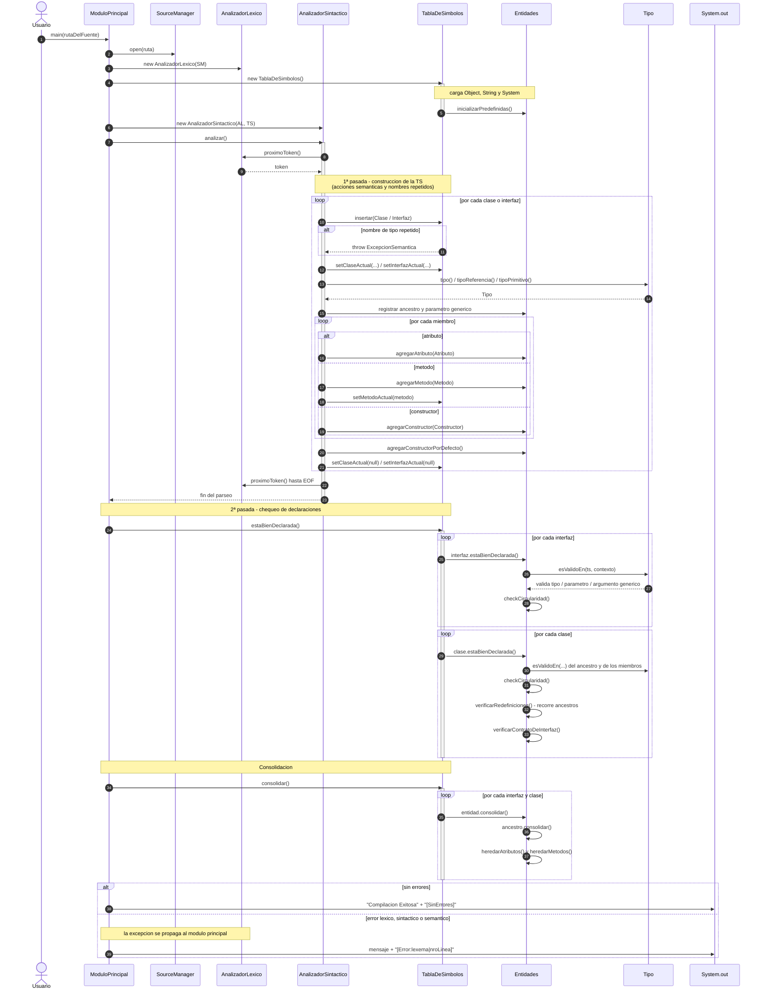

# Diagrama de secuencia — Compilador MiniJava (Etapa 3)

Flujo completo del compilador, desde que el módulo principal abre el fuente hasta
que reporta el resultado: análisis léxico/sintáctico con construcción de la Tabla de
Símbolos (1ª pasada), chequeo de declaraciones (2ª pasada) y consolidación.

Para visualizarlo: pegar el bloque en <https://mermaid.live> o abrirlo en un visor
que soporte Mermaid (GitHub, VS Code con extensión).

## Notas

- **Construcción (1ª pasada)**: las acciones semánticas viven en el
  `AnalizadorSintactico`; la TS es global y va almacenando las entidades a medida
  que se reconocen. Los controles de nombres repetidos ocurren al insertar.
- **Chequeo (2ª pasada)**: arranca desde la TS (`estaBienDeclarada`), que delega en
  cada clase/interfaz; cada entidad controla sus tipos, su relación de herencia y su
  circularidad, y la clase controla redefiniciones y contrato de interfaces.
- **Consolidación**: delega hacia el ancestro (recursión) y luego incorpora
  atributos y métodos heredados, instanciando o conservando los parámetros de tipo.
- **Errores**: cualquier `ExcepcionLexica`, `ExcepcionSintactica` o
  `ExcepcionSemantica` se propaga hasta `ModuloPrincipal`, que la reporta y finaliza.
